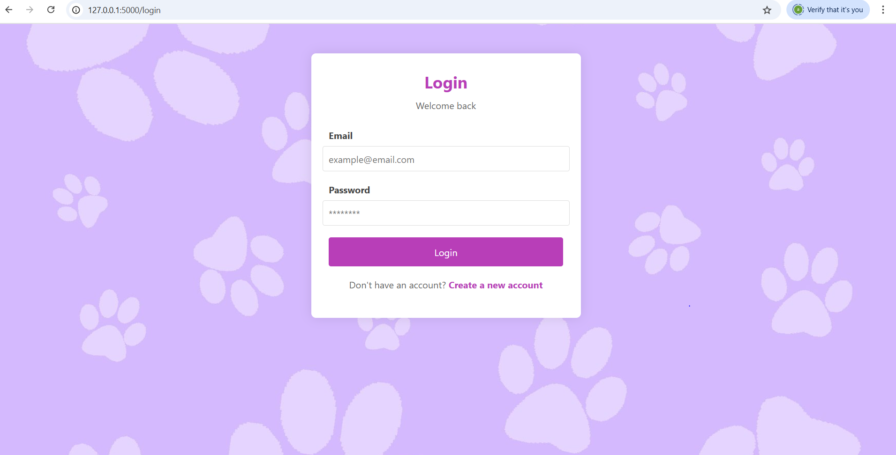
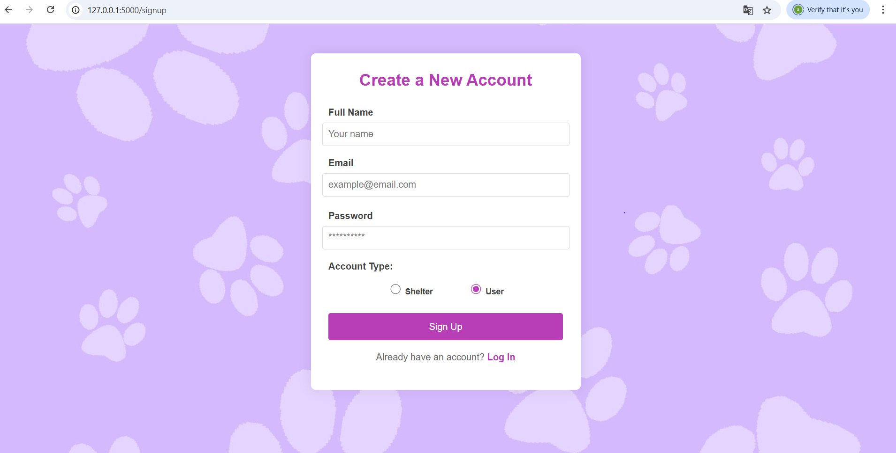
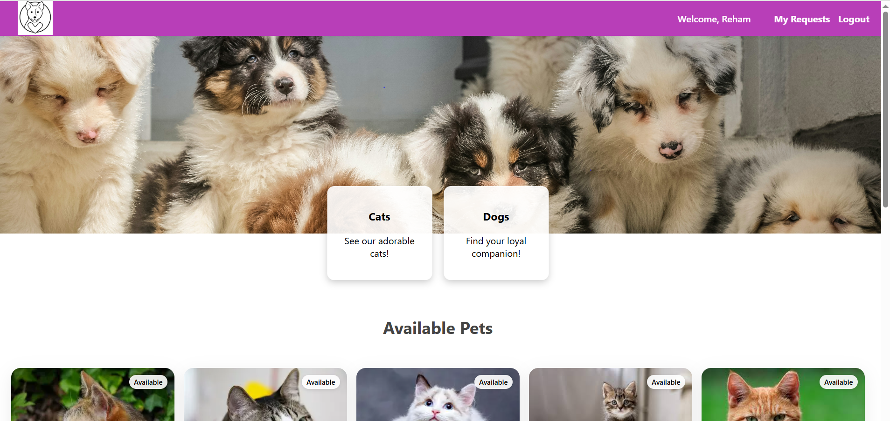
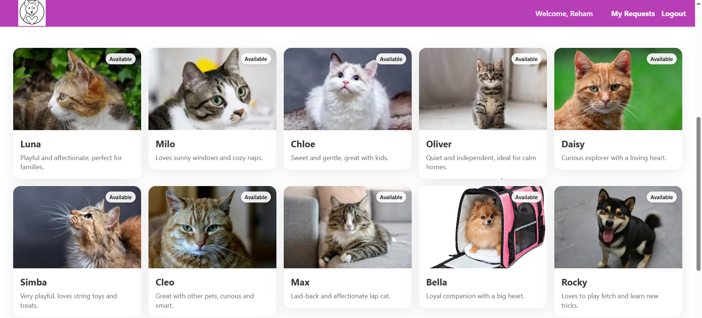
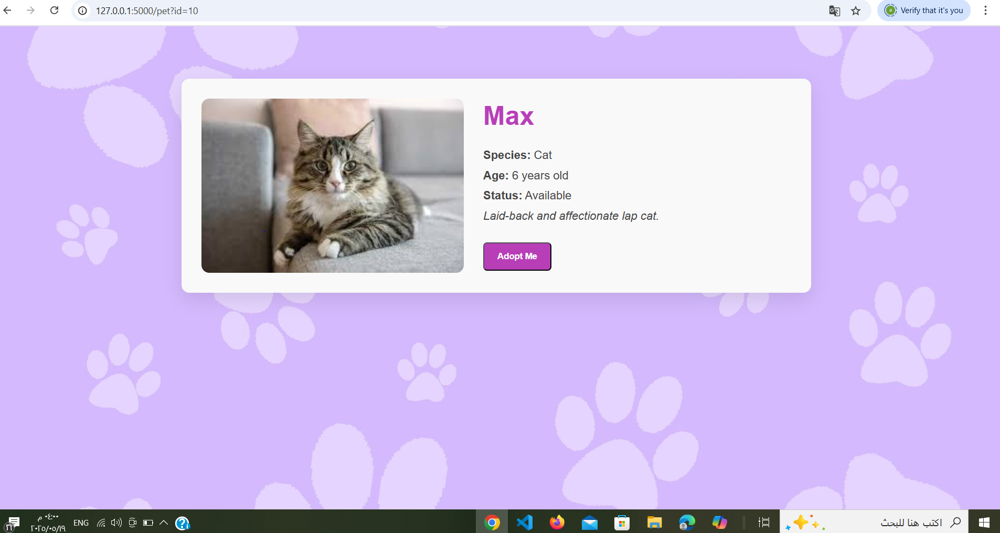
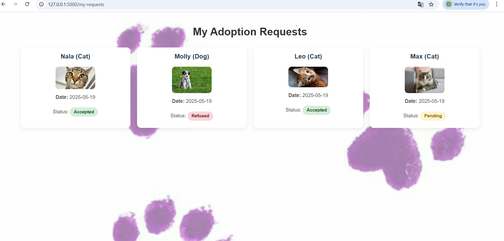
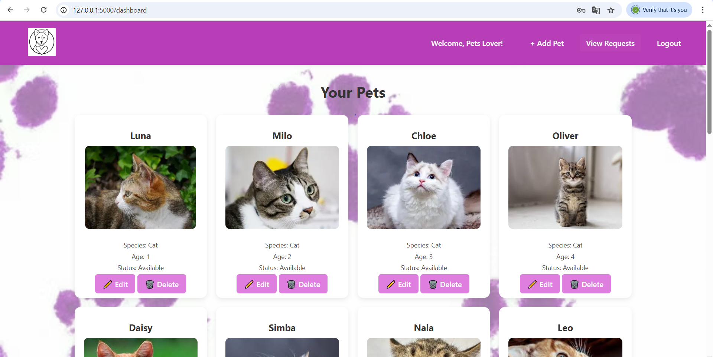
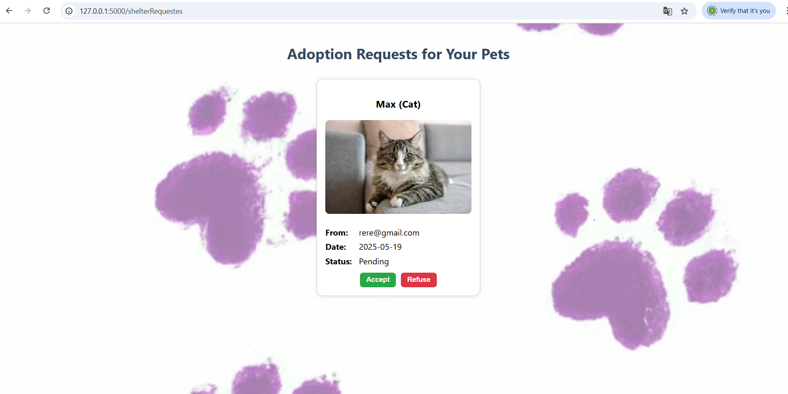
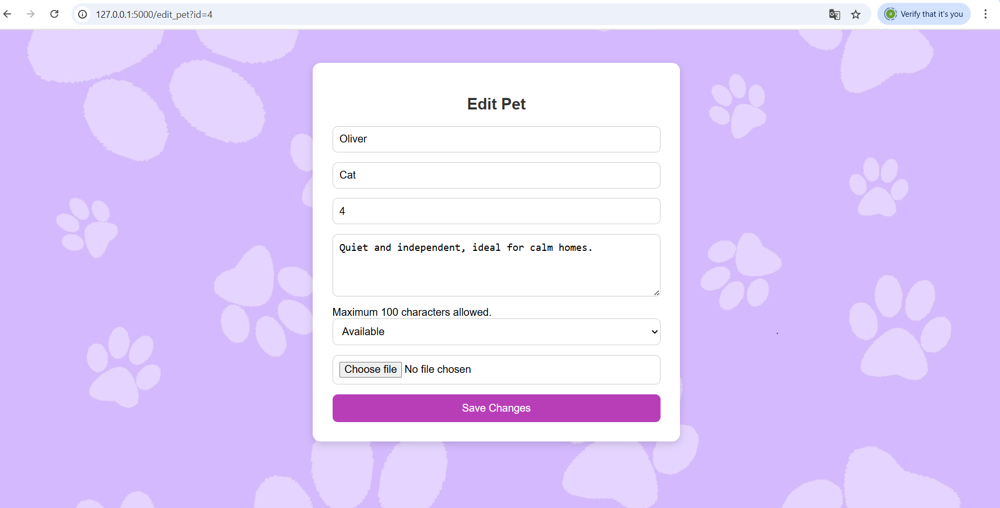
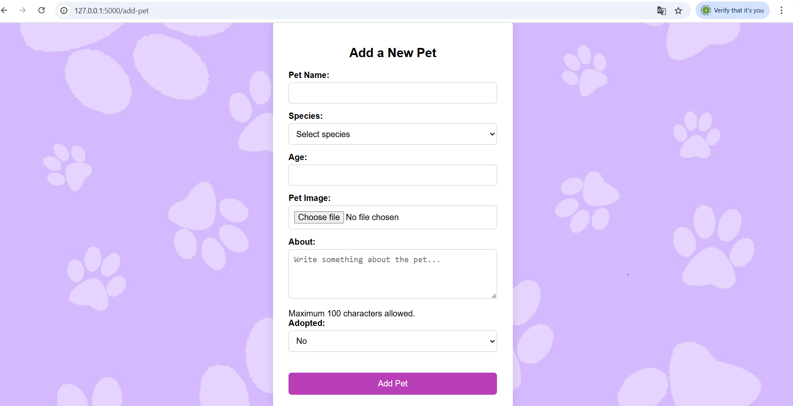

# MY FINAL PROJECT
A one or two sentence description of your project here.
- What does it do?
"A web application that connects animal shelters with potential adopters. Users can browse pets, view details, and send adoption requests, while shelters manage their listed animals through a personalized dashboard"

- What is the "new feature" which you have implemented that
we haven't seen before?
 "A  feature implemented in this pet adoption app is the shelter dashboard, where logged-in shelters can view, add, edit, and delete their listed pets, as well as see adoption requests specifically for their animals."
## Prerequisites
Did you add any additional modules that someone needs to
install (for instance anything in Python that you `pip
install-ed`)?
No
## Project Checklist
- [✔️] It is available on GitHub.
- [✔️] It uses the Flask web framework.
- [✔️] It uses at least one module from the Python Standard
Library other than the random module.
 Please provide the name of the module you are using in your
app.
 - Module name:datetime 
- [✔️] It contains at least one class written by you that has
both properties and methods. It uses `__init__()` to let the
class initialize the object's attributes (note that
`__init__()` doesn't count as a method). This includes
instantiating the class and using the methods in your app.
Please provide below the file name and the line number(s) of
at least one example of a class definition in your code as
well as the names of two properties and two methods.
 - File name for the class definition:models/pet.py
 - Line number(s) for the class definition: Line 5 to Line 13
 - Name of two properties:pet_id, adopted
 - Name of two methods:load_pets(),save_pet(pets)
 - File name and line numbers where the methods are used:app.y  Line 298 and Line 288
- [✔️] It makes use of JavaScript in the front end and uses the
localStorage of the web browser.
- [✔️] It uses modern JavaScript (for example, let and const
rather than var).
- [✔️] It makes use of the reading and writing to the same file
feature.
- [✔️] It contains conditional statements. Please provide below
the file name and the line number(s) of at least
 one example of a conditional statement in your code.
 - File name:app.py
 - Line number(s):398
- [✔️] It contains loops. Please provide below the file name
and the line number(s) of at least
 one example of a loop in your code.
 - File name:app.py
 - Line number(s):97 to 99
- [✔️] It lets the user enter a value in a text box at some
point.
 This value is received and processed by your back end
Python code.
- [✔️] It doesn't generate any error message even if the user
enters a wrong input.
- [✔️] It is styled using your own CSS.
- [✔️] The code follows the code and style conventions as
introduced in the course, is fully documented using comments
and doesn't contain unused or experimental code.
 In particular, the code should not use `print()` or
`console.log()` for any information the app user should see.
Instead, all user feedback needs to be visible in the
browser.
- [✔️] All exercises have been completed as per the
requirements and pushed to the respective GitHub repository

